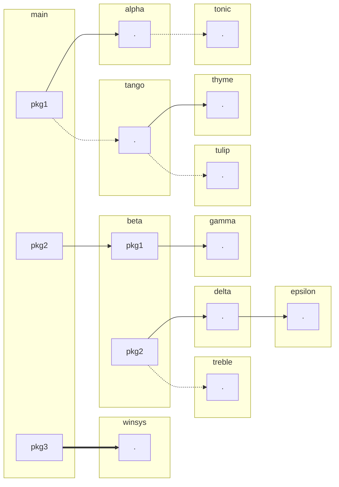

```mermaid
flowchart LR
    subgraph main["main"]
        main_pkg1["pkg1"]
        main_pkg2["pkg2"]
        main_pkg3["pkg3"]
    end
    
    subgraph beta["beta"]
        beta_pkg1["pkg1"]
        beta_pkg2["pkg2"]
    end
    
    subgraph alpha["alpha"]
        alpha_["."]
    end
    
    subgraph gamma["gamma"]
        gamma_["."]
    end
    
    subgraph delta["delta"]
        delta_["."]
    end
    
    subgraph epsilon["epsilon"]
        epsilon_["."]
    end

    subgraph tango["tango"]
        tango_["."]
    end
    
    subgraph tonic["tonic"]
        tonic_["."]
    end
    
    subgraph treble["treble"]
        treble_["."]
    end
    
    subgraph thyme["thyme"]
        thyme_["."]
    end
    
    subgraph tulip["tulip"]
        tulip_["."]
    end
    
    subgraph winsys["winsys"]
        winsys_["."]
    end
    
    main_pkg1 --> alpha_
    main_pkg2 --> beta_pkg1
    beta_pkg1 --> gamma_
    beta_pkg2 --> delta_
    delta_ --> epsilon_
    main_pkg1 -.-> tango_
    alpha_ -.-> tonic_
    beta_pkg2 -.-> treble_
    tango_ --> thyme_
    tango_ -.-> tulip_
    main_pkg3 ==> winsys_
```
